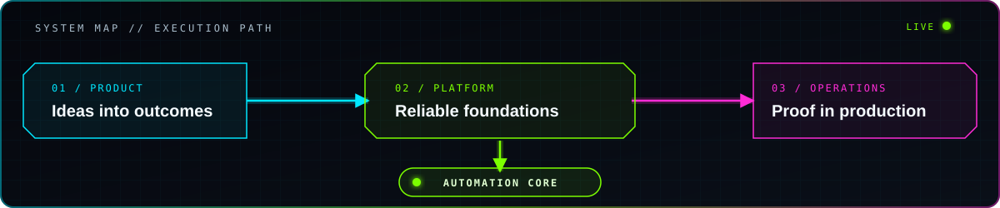

<div align="center">


# `falconexlover // systems online`

**Systems & Automation Engineer · TechOps · Full-stack delivery**

I build software that survives contact with production — from product flows and APIs to deployment, observability, runbooks, and incident closure.

[](https://www.typescriptlang.org/)
[](https://www.python.org/)
[](https://www.postgresql.org/)
[](https://www.docker.com/)
[](https://github.com/features/actions)

</div>

```text
> booting systems profile...
> product engineering ........ READY
> infrastructure & automation  READY
> observability & recovery .... READY
> real-world acceptance ....... REQUIRED
```

## `01 // systems profile`

My work sits where product engineering meets operations. I design and ship customer-facing applications, internal tools, automation, and the production systems around them. The finish line is a working business flow — backed by tests, logs, monitoring, documentation, and a recovery path.

- **Systems & TechOps:** Windows and remote-work environments, enterprise applications, endpoint support, backups, monitoring, and evidence-led incident response.
- **Full-stack engineering:** TypeScript, Next.js, React, Node.js, Python, APIs, PostgreSQL, Redis, and maintainable domain workflows.
- **Delivery engineering:** Docker, Nginx, CI/CD, environment management, smoke tests, observability, release runbooks, and rollback planning.
- **Automation:** repetitive operational work turned into explicit, reviewable, and recoverable procedures.
- **AI-assisted engineering:** LLMs used as force multipliers for research, prototyping, implementation, and review — with human judgment and production evidence as the gate.



## `02 // selected missions`

| Mission | What I delivered | Core systems | Case file |
|:--|:--|:--|:--:|
| **Booking & operations platform** | Production architecture, deployment flow, configuration boundaries, observability, security checks, and operational runbooks | Node.js · PostgreSQL · Redis · Docker · Nginx · Prometheus · Grafana · Loki | [Open →](case-studies/booking-operations-platform.md) |
| **Catalog & commerce platform** | Typed catalog and request workflows, search and filters, data modeling, API validation, SEO foundations, and automated quality gates | Next.js · TypeScript · React · Prisma · PostgreSQL · Zod | [Open →](case-studies/catalog-commerce-platform.md) |
| **Employee operations portal** | A configurable request engine spanning 30 request types and 13 departments, role-based queues, SLA workflows, offline support, backups, and deployment documentation | Next.js · TypeScript · PostgreSQL · Docker · Playwright · PWA | [Open →](case-studies/employee-operations-portal.md) |
| **Enterprise operations** | Day-to-day reliability across employee endpoints, remote access, business applications, printing, monitoring, backup, and incident recovery | Windows · RDS · PowerShell · SQL · monitoring & support tooling | Private environment |

## `03 // public signal`

### [Mini CRM lead routing service](https://github.com/falconexlover/CRM_TEST)

FastAPI service for weighted lead routing with workload limits, analytics, validation, and OpenAPI documentation.

### [URL shortener](https://github.com/falconexlover/url-shortener-boto)

Compact FastAPI application with SQLite persistence, input validation, CRUD endpoints, and automated tests.

## `04 // systems matrix`

| Layer | Tools and practices |
|:--|:--|
| **Product** | TypeScript · Next.js · React · Tailwind CSS · PWA · accessible, responsive interfaces |
| **Services** | Node.js · Python · FastAPI · REST APIs · Zod · typed contracts |
| **Data** | PostgreSQL · SQLite · Redis · Prisma · migrations · backup and restore workflows |
| **Platform** | Docker · Docker Compose · Nginx · Linux · Windows · PowerShell |
| **Delivery** | GitHub Actions · branch governance · tests · smoke checks · security scanning · release runbooks |
| **Observability** | structured logs · Prometheus · Grafana · Loki · Alertmanager · operational dashboards |
| **Quality loop** | Playwright · validation · monitoring · rollback planning · real-user scenario verification |

## `05 // operating protocol`

```text
[signal] -> [evidence] -> [smallest safe change] -> [verification] -> [runbook]
     ^                                                              |
     +----------------------- feedback loop -------------------------+
```

1. Start with the real user or business outcome.
2. Inspect the system before changing it; reconcile conflicting signals.
3. Make the smallest reversible change that addresses the cause.
4. Verify through tests, telemetry, and the actual operating scenario.
5. Leave the system easier to understand, recover, and extend.

## `06 // current trajectory`

I am deepening the connection between **TechOps, automation, and full-stack product engineering**: systems where delivery does not stop at a merge, and operations do not depend on tribal knowledge.

Areas I keep exploring:

- agentic and AI-assisted engineering workflows;
- safer infrastructure and business-process automation;
- observable, recoverable deployment systems;
- internal platforms that turn manual operations into coherent products.

---

<div align="center">

`BUILD WITH CONTEXT // OPERATE WITH EVIDENCE // RECOVER BY DESIGN`

</div>
