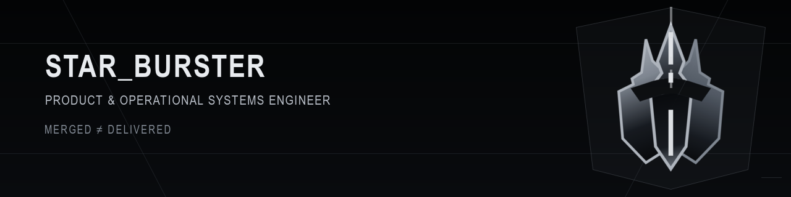

<picture>
  <source media="(max-width: 720px)" srcset="../assets/brand/github-readme-hero-mobile-780x390.png">
  
</picture>

[← Back to the profile](../README.md)

# Booking & Operations Platform

**Owner-authored case study · Product delivery · Platform engineering · Observability**

## Context

A customer-facing booking platform needed more than application code. The delivery path also had to make configuration, service dependencies, releases, operating signals, and recovery work understandable after launch.

## Constraint

The working flow crossed the application, PostgreSQL, Redis, Nginx, containers, and the monitoring stack. A repository event alone could not show whether that complete path was ready to operate.

## Decisions

- structured the backend and frontend delivery flow around Node.js, PostgreSQL, Redis, Docker Compose, and Nginx;
- separated environment-specific configuration from the application and documented service dependencies;
- added structured logs, Prometheus metrics, Grafana dashboards, Loki, and Alertmanager;
- defined GitHub Actions validation, security scanning, staging checks, release checks, and deployment runbooks;
- treated recovery instructions as part of delivery rather than post-release housekeeping.

## Verification path

```text
CHANGE → AUTOMATED CHECKS → STAGING CHECK → RELEASE → SIGNALS → RECOVERY PATH
```

The public case documents the controls and the expected verification sequence. It does not expose private dashboards, customer data, internal addresses, or production credentials.

## Result

The application stack, release path, monitoring surface, configuration boundaries, and recovery responsibilities are documented as one operating system instead of unrelated tools.

## Evidence boundary

This case demonstrates the documented architecture and operating method. It does not independently prove uptime, revenue, performance improvement, customer acceptance, or production scale.

## Коротко по-русски

Платформа бронирования описана как единый рабочий контур: приложение, данные, кеш, прокси, выпуск, наблюдаемость и восстановление. Публичный кейс подтверждает состав стека и метод проверки, но не заявляет неподтверждённые показатели бизнеса, производительности или доступности.

[← Back to the profile](../README.md)
