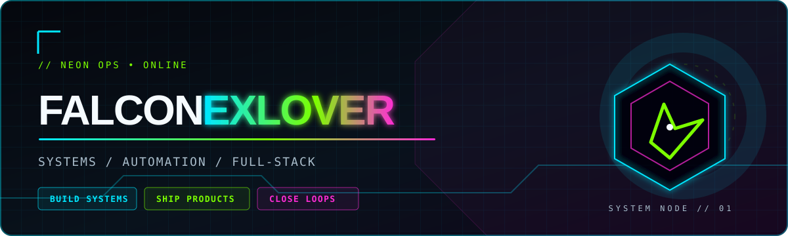

<div align="center">



# `MISSION FILE // OPS-02`

**CATALOG & COMMERCE PLATFORM**

`FULL-STACK PRODUCT` · `TYPED WORKFLOWS` · `QUALITY GATES`

</div>

[← Return to operator profile](../README.md)

## `01 // context`
A modern product catalog and customer-request platform needed a maintainable frontend, data model, API layer, and quality controls.

## `02 // independent delivery`
- Built the application using Next.js, TypeScript, React, Prisma, PostgreSQL, Tailwind CSS, and Zod.
- Implemented product catalog workflows, search, filters, service-location discovery, forms, and API routes.
- Added SEO foundations and request validation.
- Established branch governance, automated quality gates, smoke testing, documentation, and frontend observability practices.

## `03 // engineering outcomes`
- The platform has a documented development workflow and repeatable checks before release.
- The data model and application behavior are maintained through Prisma migrations and typed interfaces.

## `04 // systems loadout`

`Next.js` · `TypeScript` · `React` · `Prisma` · `PostgreSQL` · `Tailwind CSS` · `Zod` · `GitHub Actions`

```text
MODEL → VALIDATE → DELIVER → MEASURE
```

[← Return to operator profile](../README.md)
